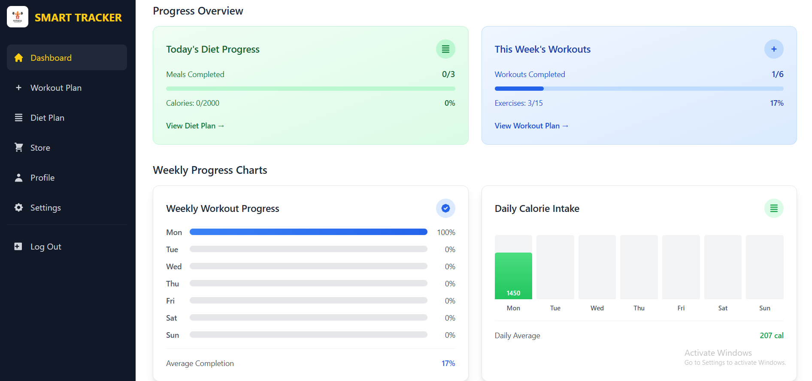
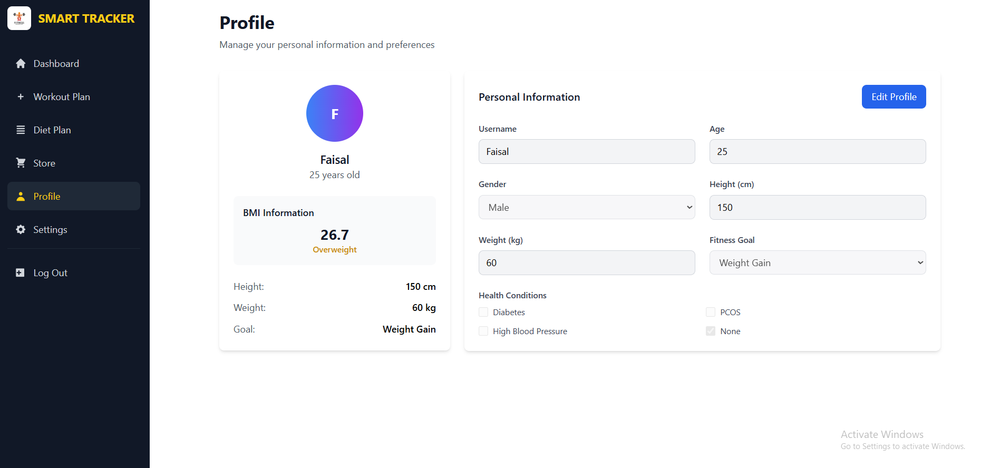
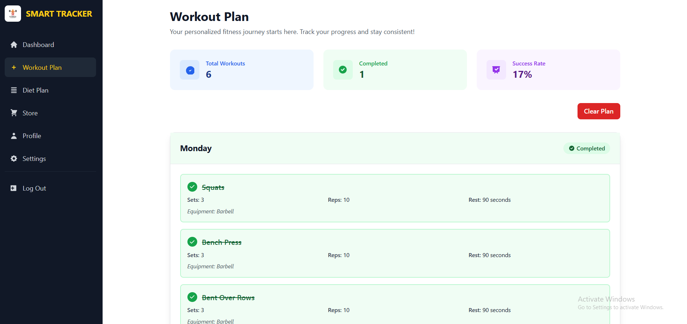
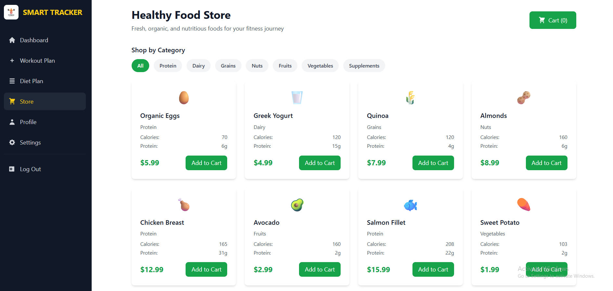

# 🏋️‍♂️ Smart Health & Fitness Tracker

<div align="center">

**Your Complete AI-Powered Fitness Companion**


*A modern, AI-powered fitness tracking application built with the MERN stack, featuring personalized workout plans, diet recommendations, and comprehensive health monitoring.*

</div>

---

## 🌟 **Key Features**

### 🤖 **AI-Powered Plan Generation**
- **Personalized Diet Plans**: AI creates custom 7-day meal plans based on your profile
- **Smart Workout Routines**: AI generates exercise plans tailored to your fitness goals
- **Health Condition Awareness**: Plans adapt to medical conditions (diabetes, PCOS, etc.)
- **Goal-Specific Nutrition**: Macro calculations for fat burning, muscle building, weight gain

### 🏠 **Comprehensive Dashboard**
- **Progress Tracking**: Real-time monitoring of diet and workout completion
- **Statistics Overview**: Weekly progress, calories consumed, workouts completed
- **Water Intake Tracking**: Daily hydration monitoring with visual progress
- **AI Health Coach**: Personalized recommendations based on your progress

### 🎨 **Modern User Experience**
- **Dark/Light Theme**: Seamless theme switching with user preferences
- **Mobile Responsive**: Optimized for all device sizes
- **Sticky Navigation**: Smooth navigation that follows as you scroll
- **Loading Animations**: Professional AI generation progress indicators with step-by-step status
- **Account Management**: Secure account deletion from database with confirmation flows

### 🔐 **Secure Authentication**
- **JWT-Based Security**: Secure user authentication and authorization
- **Password Reset**: Email-based password recovery system
- **Account Management**: Complete profile management and account deletion
- **Data Privacy**: User-specific data isolation and protection

---

## 📸 **Screenshots**

### 🏠 Dashboard Overview

*Main dashboard showing progress statistics, AI recommendations, and health tracking with dark/light theme support*

### 👤 User Profile & Settings

*Comprehensive user profile with health information, fitness goals, and advanced settings including notification preferences*

### 🏋️ AI-Generated Workout Plans

*AI-powered workout plans with exercise details, sets, reps, progress tracking, and real-time completion status*

### 🛒 Store Integration

*Integrated store for fitness products, supplements, and health accessories with cart functionality*

---

## 🚀 **Live Demo**

Experience the full application: **[Smart Health Tracker](https://smart-health-care-git-main-faisal-hanifs-projects.vercel.app/)**


## 🛠️ **Technology Stack**

### **Frontend**
- **React 18** with TypeScript
- **Tailwind CSS** for styling
- **React Router** for navigation
- **Context API** for state management
- **Vite** for build tooling

### **Backend**
- **Node.js** with Express.js
- **MongoDB** with Mongoose ODM
- **JWT** for authentication
- **bcryptjs** for password hashing
- **Nodemailer** for email services

### **AI Integration**
- **OpenAI GPT-4** for plan generation
- **Custom AI Prompting** for health-specific responses
- **Fallback Services** for reliability

### **Deployment**
- **Frontend**: Vercel
- **Backend**: Render/Railway
- **Database**: MongoDB Atlas

---

## 🎯 **Core Functionalities**

### 🤖 **AI Plan Generation**
```typescript
// Generate personalized diet plans
const dietPlan = await generateDietPlan({
  age: 25,
  gender: 'male',
  fitnessGoal: 'Fat Burning',
  healthConditions: ['None'],
  preferences: 'High protein, low carb'
});
```

**Features:**
- ✅ Goal-specific macro calculations
- ✅ Health condition considerations
- ✅ 7-day meal planning
- ✅ Calorie and nutrient tracking
- ✅ Meal timing optimization

### 🏋️ **Workout Management**
```typescript
// Create custom workout routines
const workoutPlan = await generateWorkoutPlan({
  fitnessGoal: 'Muscle Building',
  experience: 'Intermediate',
  equipment: 'Gym',
  duration: '45 minutes'
});
```

**Features:**
- ✅ Exercise selection based on goals
- ✅ Progressive overload principles
- ✅ Equipment-specific routines
- ✅ Rest time optimization
- ✅ Weekly progression tracking

### 📊 **Progress Tracking**
- **Diet Progress**: Meal completion, calorie tracking, macro distribution
- **Workout Progress**: Exercise completion, weekly stats, success rates
- **Water Intake**: Daily hydration goals with visual progress
- **Overall Health**: Comprehensive dashboard with AI insights

### 🔔 **Smart Notifications**
- **Workout Reminders**: Browser notifications with custom scheduling and sound effects
- **Progress Alerts**: Achievement notifications and milestone celebrations
- **Motivational Messages**: AI-powered encouragement based on progress
- **Sound Integration**: Energetic workout sounds with volume control
- **Visual Notifications**: Professional loading animations during AI plan generation
- **Success Confirmations**: Custom branded alert modals for important actions

---

## 📱 **Mobile Experience**

### 📲 **Responsive Design**
- **Mobile-First Approach**: Optimized for smartphones and tablets
- **Touch-Friendly Interface**: Large buttons and swipe gestures
- **Compressed Navigation**: Collapsible menus and smart layouts
- **Fast Loading**: Optimized images and efficient caching

### 🔍 **Mobile Features**
- **Search Optimization**: Expandable search with mobile overlay
- **Sticky Headers**: Navigation that follows scroll
- **Gesture Support**: Swipe actions and touch interactions
- **Offline Capability**: Progressive Web App features

---

## 🎨 **Design System**

### 🌙 **Theme Support**
- **Light Theme**: Clean, professional appearance for daytime use
- **Dark Theme**: Eye-friendly design for low-light environments
- **System Sync**: Automatic theme detection based on OS preferences
- **Smooth Transitions**: Animated theme switching

### 🎯 **UI/UX Principles**
- **Consistency**: Unified design language across all components
- **Accessibility**: Screen reader support and keyboard navigation
- **Performance**: Optimized animations and efficient rendering
- **Feedback**: Clear loading states and user confirmations

---

## 🔒 **Security Features**

### 🛡️ **Authentication & Authorization**
- **JWT Tokens**: Secure session management
- **Password Hashing**: bcryptjs encryption
- **Rate Limiting**: API protection against abuse
- **Input Validation**: Comprehensive data sanitization

### 🔐 **Data Protection**
- **User Isolation**: Complete data separation between users
- **Secure Storage**: Encrypted sensitive information
- **HTTPS Enforcement**: Secure data transmission
- **Privacy Controls**: User data export and deletion options

---

## 📋 **Installation & Setup**

### 🔧 **Prerequisites**
- Node.js (v18+)
- MongoDB
- OpenAI API Key

### 🚀 **Quick Start**

1. **Clone the repository**
```bash
git clone https://github.com/FaisalHanif12/Smart-health-Care.git
cd Smart-health-Care
```

2. **Backend Setup**
```bash
cd backend
npm install
```

Create `.env` file:
```env
NODE_ENV=development
PORT=5000
MONGO_URI=your_mongodb_connection_string
JWT_SECRET=your_jwt_secret
JWT_EXPIRE=7d
JWT_COOKIE_EXPIRE=7
OPENAI_API_KEY=your_openai_api_key
EMAIL_FROM=your_email
EMAIL_HOST=smtp.gmail.com
EMAIL_PORT=587
EMAIL_USER=your_email
EMAIL_PASS=your_app_password
```

3. **Frontend Setup**
```bash
cd frontend
npm install
```

Create `.env` file:
```env
VITE_API_BASE_URL=http://localhost:5000/api
VITE_OPENAI_API_KEY=your_openai_api_key
```

4. **Run the application**
```bash
# Backend (Terminal 1)
cd backend && npm start

# Frontend (Terminal 2)
cd frontend && npm run dev
```

5. **Access the application**
- Frontend: `http://localhost:5173`
- Backend: `http://localhost:5000`

---

## 🏗️ **Project Structure**

```
Smart-health-Care/
├── 📁 backend/
│   ├── 📁 config/          # Database configuration
│   ├── 📁 controllers/     # Route controllers
│   ├── 📁 middleware/      # Auth & validation middleware
│   ├── 📁 models/          # MongoDB models
│   ├── 📁 routes/          # API routes
│   ├── 📁 services/        # Business logic (OpenAI, Email)
│   ├── 📁 utils/           # Helper functions
│   └── 📄 server.js        # Application entry point
├── 📁 frontend/
│   ├── 📁 public/
│   │   └── 📁 Imgs/        # Screenshot images
│   ├── 📁 src/
│   │   ├── 📁 components/  # React components
│   │   │   └── 📁 Dashboard/ # Dashboard components
│   │   ├── 📁 contexts/    # React contexts
│   │   ├── 📁 hooks/       # Custom hooks
│   │   ├── 📁 pages/       # Page components
│   │   ├── 📁 services/    # API services
│   │   └── 📁 utils/       # Utility functions
│   └── 📄 vite.config.ts   # Vite configuration
└── 📄 README.md            # This file
```

---

## 💫 **Feature Showcase**

### 🤖 **AI-Powered Features**
| Feature | Description | Status |
|---------|-------------|--------|
| **Diet Plan Generation** | 7-day personalized meal plans with macros | ✅ Live |
| **Workout Plan Creation** | Goal-specific exercise routines | ✅ Live |
| **Health Coach Recommendations** | AI insights based on progress | ✅ Live |
| **Smart Notifications** | Contextual reminders and alerts | ✅ Live |
| **Progress Analytics** | Real-time tracking with visualizations | ✅ Live |

### 🎯 **User Experience Features**
| Feature | Description | Status |
|---------|-------------|--------|
| **Responsive Design** | Mobile-first with desktop optimization | ✅ Live |
| **Dark/Light Themes** | Seamless theme switching | ✅ Live |
| **Sticky Navigation** | Smooth scrolling navigation | ✅ Live |
| **Loading Animations** | Professional AI generation feedback | ✅ Live |
| **Account Management** | Complete profile and security controls | ✅ Live |

### 🔐 **Security & Performance**
| Feature | Description | Status |
|---------|-------------|--------|
| **JWT Authentication** | Secure token-based sessions | ✅ Live |
| **Data Encryption** | Password hashing and secure storage | ✅ Live |
| **User Isolation** | Complete data separation | ✅ Live |
| **Fast AI Generation** | 30-40% speed optimization | ✅ Live |
| **Image Optimization** | Instant background loading | ✅ Live |

---

## 🔄 **API Endpoints**

### 🔐 **Authentication**
```http
POST /api/auth/register     # User registration
POST /api/auth/login        # User login
GET  /api/auth/logout       # User logout
GET  /api/auth/me           # Get user profile
PUT  /api/auth/updateprofile # Update user profile
DELETE /api/auth/deleteaccount # Delete user account
```

### 🤖 **AI Services**
```http
POST /api/ai/generate-diet-plan    # Generate diet plan
POST /api/ai/generate-workout-plan # Generate workout plan
POST /api/ai/recommendations       # Get AI recommendations
```

---

## 🎯 **Key Features Deep Dive**

### 🤖 **AI Plan Generation**
- **Contextual Prompting**: AI understands user's health conditions and goals
- **Macro Optimization**: Precise calorie and nutrient calculations
- **Exercise Selection**: Equipment-aware workout recommendations
- **Progress Adaptation**: Plans evolve based on user progress

### 📊 **Progress Analytics**
- **Real-time Tracking**: Live updates as users complete activities
- **Visual Charts**: Progress visualization with charts and graphs
- **Achievement System**: Milestone celebrations and badges
- **Historical Data**: Archive system for long-term progress tracking

### 🔔 **Smart Notifications**
- **Browser Integration**: Native browser notification support
- **Custom Scheduling**: User-defined reminder times
- **Progress Triggers**: Notifications based on completion rates
- **Sound Effects**: Audio feedback for important events

### 🎨 **User Experience**
- **Loading States**: Engaging animations during AI generation
- **Error Handling**: Graceful error recovery with user feedback
- **Accessibility**: Screen reader support and keyboard navigation
- **Performance**: Optimized for fast loading and smooth interactions

---

## 🆕 **Latest Updates & Improvements**

### ⚡ **Performance Optimizations (v2.0)**
- **30-40% Faster AI Generation**: Reduced token limits and optimized temperature settings
- **Enhanced Loading Experience**: Step-by-step progress indicators with animated modals
- **Real-time Status Updates**: Users see exactly what AI is doing during plan generation
- **Optimized Background Images**: Instant loading with preload techniques and fallback colors
- **Improved Mobile Experience**: Sticky navigation and responsive search functionality

### 🔐 **Security Enhancements**
- **Database Account Deletion**: Real account removal from MongoDB (not just local data clearing)
- **Custom Alert System**: Professional branded success/error notifications
- **Progress Data Management**: Clear specific plan progress when plans are deleted
- **Enhanced Authentication**: Improved JWT handling and session management

### 🎨 **UI/UX Improvements**
- **Professional Loading Modals**: Branded animations during AI generation
- **Dynamic Status Messages**: Contextual feedback for diet vs workout generation  
- **Mobile Header Optimization**: Streamlined navigation with fitness tracker logo
- **Theme Consistency**: Improved dark mode support across all components

---

## 🌟 **What Makes This Special**

### 🔬 **Advanced AI Integration**
- **Dual AI Services**: Backend and frontend OpenAI integration for reliability
- **Health-Aware AI**: AI considers medical conditions in recommendations
- **Dynamic Prompting**: Context-aware AI conversations
- **Fallback Systems**: Multiple AI service layers for 99% uptime

### 📱 **Modern Architecture**
- **TypeScript**: Full type safety across the application
- **Context API**: Efficient state management without external libraries
- **Component Architecture**: Modular, reusable components
- **Progressive Enhancement**: Works without JavaScript enabled

### 🚀 **Performance Optimizations**
- **Image Optimization**: WebP format with lazy loading
- **Code Splitting**: Dynamic imports for faster initial loads
- **Caching Strategy**: Intelligent data caching for offline support
- **Bundle Optimization**: Tree shaking and minification

---

## 🤝 **Contributing**

We welcome contributions! Please see our [Contributing Guidelines](CONTRIBUTING.md) for details.

### 🐛 **Bug Reports**
- Use the [GitHub Issues](https://github.com/FaisalHanif12/Smart-health-Care/issues) page
- Include detailed reproduction steps
- Provide environment information

### 💡 **Feature Requests**
- Open a [Feature Request](https://github.com/FaisalHanif12/Smart-health-Care/issues/new?template=feature_request.md)
- Describe the use case and expected behavior
- Include mockups or examples if applicable

---

## 📄 **License**

This project is licensed under the MIT License - see the [LICENSE](LICENSE) file for details.

---

## 👨‍💻 **Author**

**Faisal Hanif**
- GitHub: [@FaisalHanif12](https://github.com/FaisalHanif12)
- LinkedIn: [Faisal Hanif](https://linkedin.com/in/faisal-hanif)
- Email: faisal.hanif.dev@gmail.com

---

## 🙏 **Acknowledgments**

- **OpenAI** for GPT-4 API
- **MongoDB** for database services
- **Vercel** for hosting and deployment
- **React Team** for the amazing framework
- **Tailwind CSS** for the utility-first CSS framework

---

## 📈 **Project Stats**


---

<div align="center">

**Made with ❤️ by [Faisal Hanif](https://github.com/FaisalHanif12)**

*Star ⭐ this repository if you found it helpful!*

</div> 
